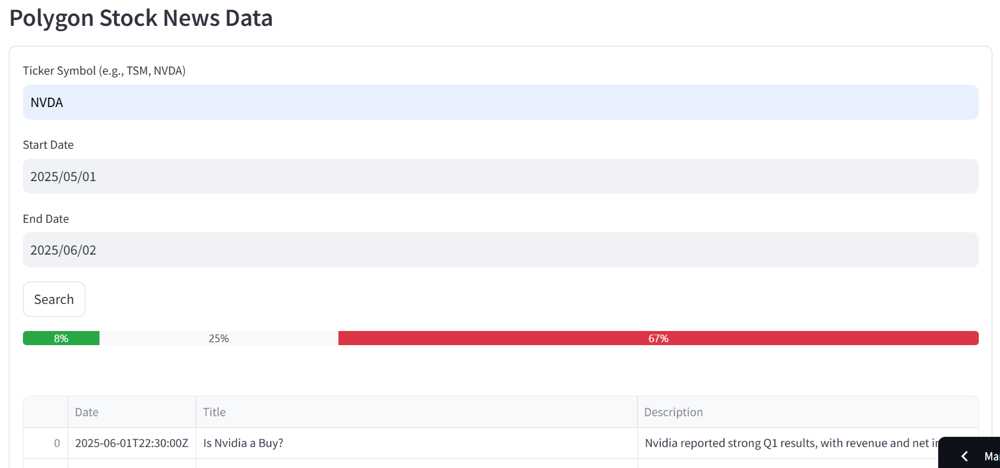
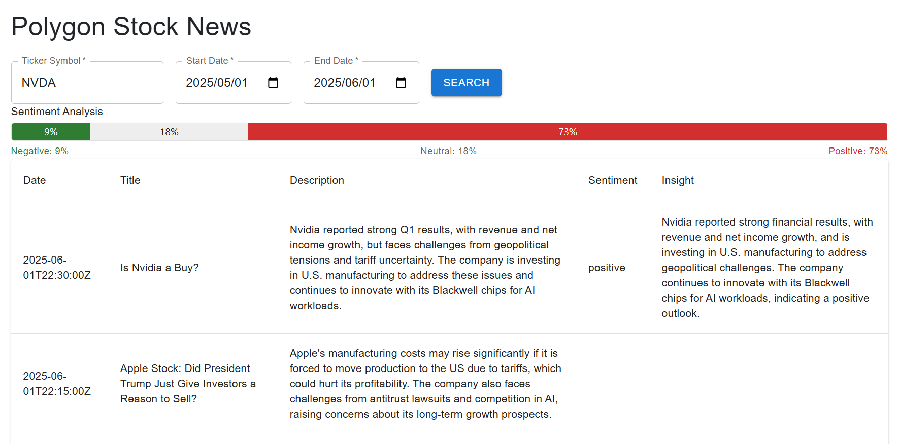

# Polygon Stock News (Streamlit app & React app)

### Streamlit version

### React version

##

- Polygon.io news api
- Python Streamlit UI component
- React mui/material UI component
- Use Cline convert Streamlit code to React with specific UI design
